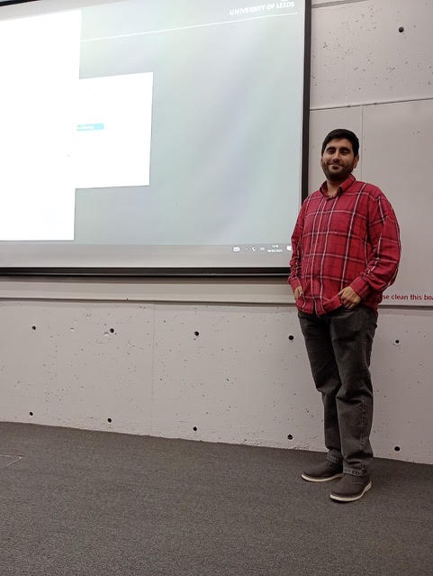

[Karin Baur](http://www1.maths.leeds.ac.uk/~pmtkb/) (University of Leeds)
_Álgebras de cluster y categorías de cluster a través de superficies._ Veinte años de investigación en la teoría de clusters han establecido profundos vínculos entre las álgebras de clusters, la geometría de superficies y la teoría de representaciones. Las estructuras de clusters pueden definirse mediante la geometría de superficies, donde las curvas corresponden a las variables de los clusters y a los objetos rígidos de las categorías asociadas. Las relaciones clásicas de Ptolomeo dan lugar a fenómenos de intercambio o mutación en las estructuras de clusters asociadas. En este curso me centraré en el enfoque geométrico de las álgebras de clusters y las categorías de clusters. Los temas a tratar incluirán estructuras de clusters en las Grassmannianas, _friezes_, laminaciones, diagramas de Postnikov, modelos de dímeros y la combinatoria de sistemas de raíces.

### Asistentes ###
_Juan Pablo Maldonado_ será el asistente de Kairin Baur para las tutorías de este curso.

Juan es estudiante de doctorado en la Universidad Nacional de Mar del Plata bajo la dirección de Karin Baur (Universidad de Leeds) y Ana García Elsener (Universidad Nacional de Mar del Plata). Sus intereses de investigación son la combinatoria, las álgebras de cúmulos, los modelos de dímeros y las álgebras jacobianas, entre otros.

 

 
