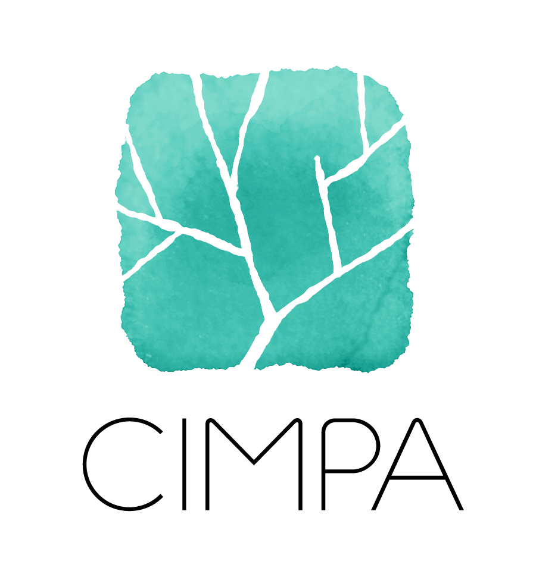
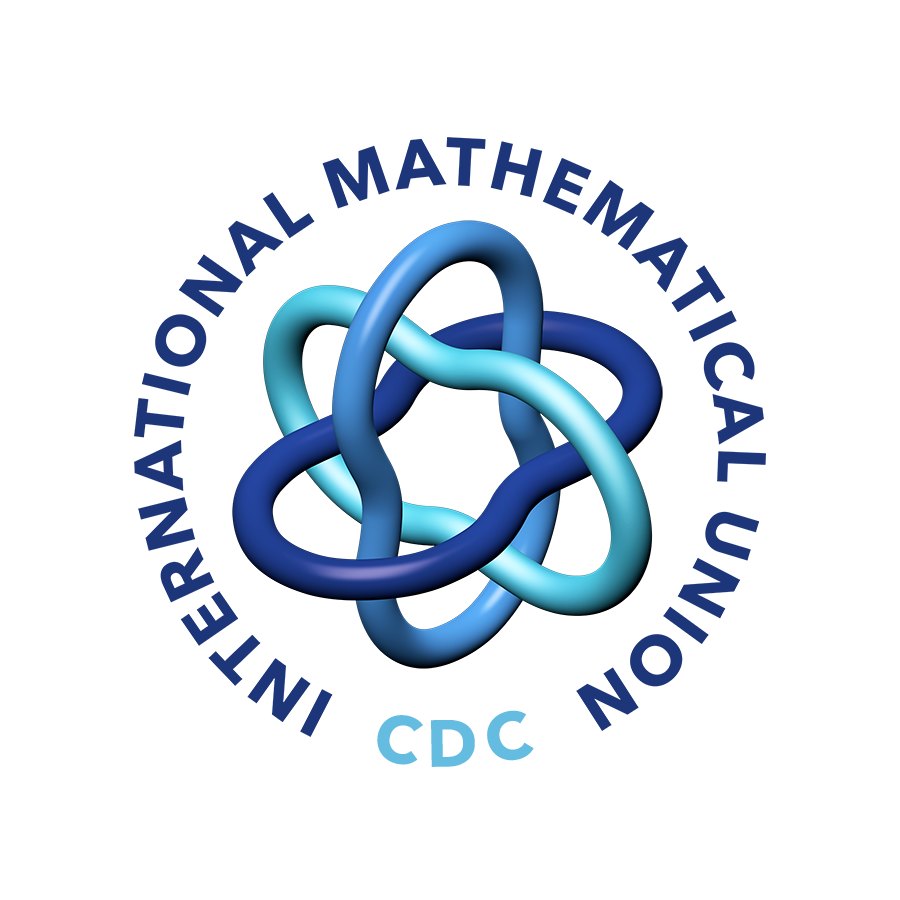

La [Escuela CIMPA](https://www.cimpa.info/en/node/9) _Crossroads of geometry, representation theory and higher structures_ tendrá lugar del 13 al 26 de marzo de 2023 en Puerto Madryn, Argentina, en el campus de la [Universidad Nacional de la Patagonia _San Juan Bosco_](http://www.unp.edu.ar). 

### Noticias

La inscripción está abierta! Todos los participantes deben registrarse con CIMPA en [este](https://www.cimpa.info/en/node/40) link. En la sección [inscripción](https://crossroads-2023-es.github.io/register.html) encontrará más detalles.

### Poster

El poster de la escuela está disponible para descargar (e imprimir) [aquí](CIMPA23poster.pdf).

### Sponsors

Agradecemos el apoyo de los siguientes patrocinadores. Contamos con una subvención del [_Programa de Apoyo a Conferencias_](https://www.mathunion.org/cdc/grants/conference-support-program) de la IMU-CDC , que cuenta con el apoyo parcial de [the Abel Board](https://abelprize.no/node/154).

&nbsp;&nbsp;&nbsp;
 &nbsp;&nbsp;&nbsp;

