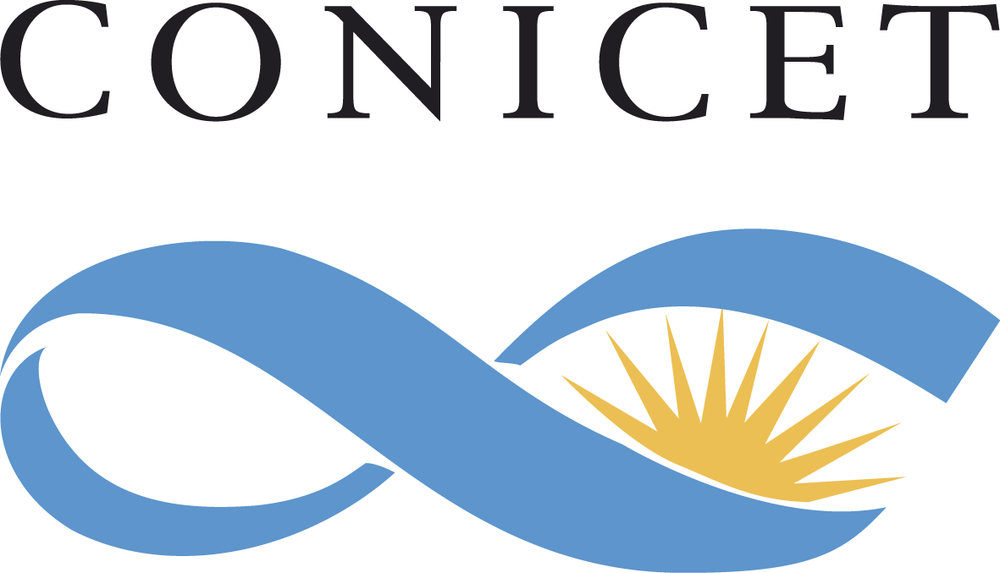

La [Escuela CIMPA](https://www.cimpa.info/en/node/9) _Crossroads of geometry, representation theory and higher structures_ tendrá lugar del 13 al 24 de marzo de 2023 en Puerto Madryn, Argentina, en el campus de la [Universidad Nacional de la Patagonia _San Juan Bosco_](http://www.unp.edu.ar). 

### Noticias

1. _Transporte local_: les recomendamos que usen la aplicación _moovit_ para obtener información sobre el transporte público local. [Aquí](https://moovitapp.com/puerto_madryn-6141/poi/3051%20Bv.%20Almirante%20Brown/Hotel%20Bah%C3%ADa%20Nueva/es-419?ref=5&customerId=4908&fll=-42.76449_-65.034777&tll=-42.785873_-65.005766&t=1) encuentran las rutas de colectivos entre  _Hotel Bahía Nueva_ al campus de la universidad. Alternativemente, pueden escanear el siguiente código QR (abre en la app de _moovit_):

 

 

2. Ya están disponibles los apuntes para el curso de David Jordan.  El curso cubrirá material del _Capítulo 2_ al _Capítulo 6_ de [este](jordan/jordan-notes.pdf) libro. Los temas del _Capítulo 1_ (representaciones de $\mathfrak{sl}(2,\mathbb C)$) son un __prerrequisito__ para el curso. ¡Asegúrense de mirarlas antes del curso!

3. ¡El programa de la escuela está disponible! 

4. [Ana García Elsener](https://sites.google.com/view/ana-garcia-elsener) (Universidad Nacional de Mar del Plata) y [Gastón García](https://www.mate.unlp.edu.ar/~ggarcia/) (Universidad Nacional de La Plata) darán breves charlas de investigación durante la escuela.

5. [Marilina Carena](https://sites.google.com/view/marilina-carena)
(Universidad Nacional del Litoral) dará una charla de divulgación durante la escuela. 
Lamentablemente, Victoria Lebed y Sarah Scherotzke han tenido que cancelar su 
participación.

### Poster

El poster de la escuela está disponible para descargar (e imprimir) [aquí](CIMPA23poster.pdf).

### Sponsors

Agradecemos el apoyo de los siguientes patrocinadores. Contamos con una subvención del [_Programa de Apoyo a Conferencias_](https://www.mathunion.org/cdc/grants/conference-support-program) de la IMU-CDC , que cuenta con el apoyo parcial de [the Abel Board](https://abelprize.no/node/154). Agradecemos también el apoyo a través de una subvención de la NSF de [Julia Pevtsova](https://sites.math.washington.edu/~julia/) y [Ralf Schiffler](https://schiffler.math.uconn.edu/).

&nbsp;&nbsp;&nbsp;
&nbsp;&nbsp;&nbsp;
 

