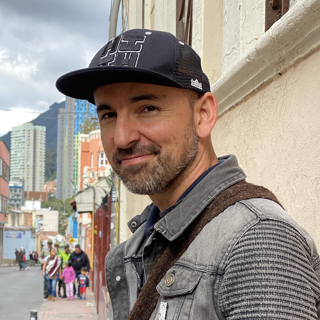
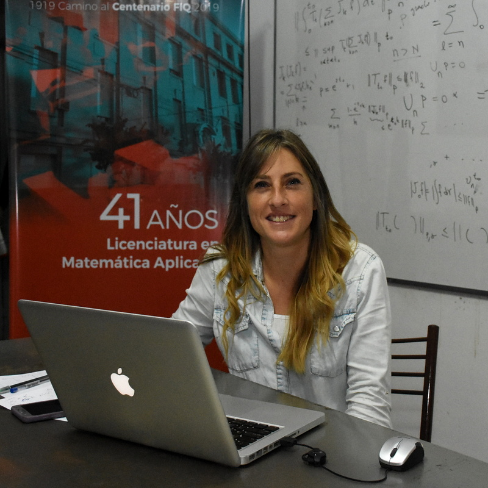
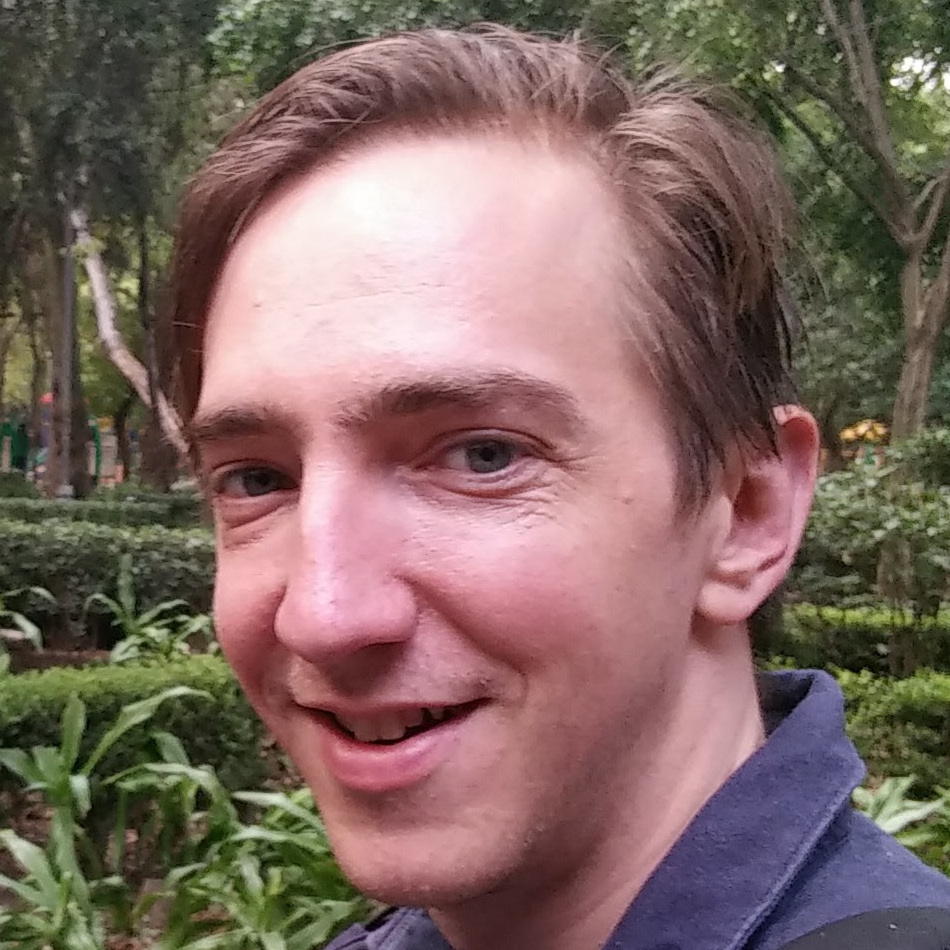
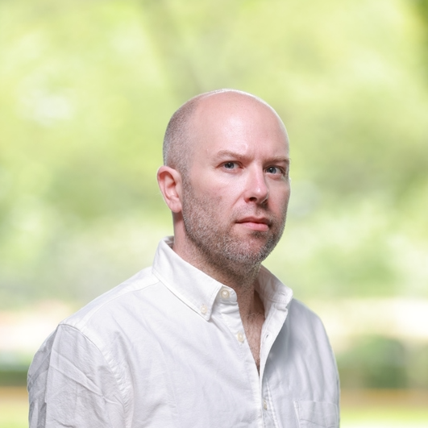

<h4>Matroides, combinatoria, y geometría</h4>

    

        
    

    
    
        

            <a href="http://math.sfsu.edu/federico/">Federico Ardila</a>  es un matemático y músico colombiano interesado en la intersección entre la combinatoria, la geometría, y el álgebra. Obtuvo su doctorado en MIT y es profesor en San Francisco State University y La Universidad de Los Andes. Es Conferencista Invitado del International Congress of Mathematicians 2022, Fellow de la American Math Society, y ganador del Premio a la Enseñanza de la Math Association of America. Ha dirigido las tesis de grado de más de 50 estudiantes y co-dirige MSRI-UP, un programa de investigación para estudiantes de minorías étnicas en Estados Unidos. En todos los aspectos de su trabajo, Federico busca contribuir a la construcción de una comunidad matemática cada vez más incluyente y equitativa. <em>Foto cortesía de May-Li Khoe</em>.
            
   
        
  
            <a href="ardila.html">Ver detalles del mini-curso.</a>
        
   
    

<h4>Álgebras de cluster y categorías de cluster a través de superficies</h4>

    

        
    

    
    
        

            <a href="http://www1.maths.leeds.ac.uk/~pmtkb/">Karin Baur </a> es profesora de Matemática Pura en la Universida de Leeds. Tras obtener su doctorado en 2002 en la Universidad de Basilea, pasó sus años de posdoctorado en el ETH, en la Universidad de California en San Diego y en la Universidad de Leicester antes de ser profesora de SNSF en el ETH. Se convirtió en profesora titular de la Universidad de Graz en 2011. Sus intereses de investigación se centran en los métodos algebraicos, combinatorios y geométricos de la teoría de representaciones. <em>Foto cortesía de Severin Nowacki</em>.
        
   
        
  
            <a href="baur.html">Ver detalles del mini-curso.</a>
        
   
    

<h4>Un desafío a la intuición</h4>

    

        
    

    
    
        

            <a href="https://sites.google.com/view/marilina-carena">Marilina Carena</a> es doctora en 
            matemática, graduada en la Facultad de Ingeniería Química de la Universidad Nacional del 
            Litoral, en Santa Fe. Se desempeña en esta facultad como Investigadora Independiente del 
            CONICET y como Profesora Asociada. Su áreas de investigación son el análisis y la teoría 
            geométrica de la medida.  Participa activamente en actividades de divulgación y es autora 
            del libro <a href="https://www.unl.edu.ar/editorial/index.php?act=showPublicacion&id=8155">La pelota siempre al 10</a>, 
            en el que se trabajan conceptos matemáticos de la escuela secundaria mediante problemas 
            referidos al fútbol. 
            
   
        
  
            <a href="carena.html">Ver detales de la charla de divulgación.</a>
        
   
    

<h4>Espacios de configuración, topología algebraica y operadas</h4>

    

        
    

    
    
        

            <a href="https://idrissi.eu/">Najib Idrissi</a> es maître de conférences en la Université Paris Cité desde 2018. Obtuvo su doctorado en matemáticas en la Universidad de Lille en 2017 bajo la dirección de Benoit Fresse y trabajó como postdoc en la ETH de Zúrich en 2018 con Thomas Willwacher. Se interesa principalmente por las operadas, ya sean algebraicas o topológicas, y sus aplicaciones al cálculo de invariantes las variedaddes y sus espacios de configuración a través de la teoría de los complejos de grafos. En 2020 recibió el <a href="https://www.college-de-france.fr/site/cours-peccot/guestlecturer-2020-03-04-11h00.htm">Premio Peccot</a> del Collège de France y fue orador en la <a href="https://idrissi.eu/research/peccot">Conferencia Peccot</a>, donde habló sobre el tipo de homotopía real de los espacios de configuración.
        
   
        
  
            <a href="idrissi.html">Ver detalles del mini-curso.</a>
        
   
    

<h4>Una introducción a la teoría de representación geométrica de los grupos cuánticos</h4>

    

        
    

    
    
        

            <a href="https://www.maths.ed.ac.uk/~djordan/">David Jordan</a> es profesor (reader) en el Instituto Hodge de la Facultad de Matemáticas de la Universidad de Edimburgo. Se doctoró en el MIT en 2011, tras lo cual obtuvo una beca de investigación posdoctoral de la NSF en la Universidad de Texas antes de incorporarse a la Universidad de Edimburgo en 2013. En 2015 obtuvo una ERC Starting Grant para estudiar la <a href="https://cordis.europa.eu/project/id/637618">teoría de campos topológicos geométricos cuánticos de Langlands</a>.  Su trabajo se centra en la topología cuántica de las variedades de 2, 3 y 4 dimensiones, combinando herramientas del álgebra superior, la teoría de la representación de los grupos cuánticos y elementos de la teoría de skein.  Con sus colaboradores ha desarrollado la base matemática para la teoría geométrica cuántica de campos topológicos de Langlands de Betti, un modelo para el twist de Kapustin–Witten de la teoría de gauge super-simétrica de Yang–Mills para N=4.
            
   
        
  
            <a href="jordan.html">Ver detalles del mini-curso.</a>
        
   
    

<h4>Teoría de representaciones y categorificación</h4>

    

        
    

    
    
        

            <a href="https://nicolaslibedinsky.cl/about-me/">Nicolás Libedinsky</a> es un matemático chileno. Estudió en la École Normale Supérieure de París y luego completó su doctorado entre la Universidad Paris Diderot y la Universidad de Oxford en 2008. Tuvo una posición postdoctoral Alexander von Humboldt en Alemania y ahora es profesor en la Universidad de Chile. Su principal interés es la teoría de la representación (modular). En 2019 publicó una "novela matemática" llamada <em>La unidad de todas las cosas</em>. 
        
   
        
  
            <a href="libedinsky.html">Ver detalles del mini-curso.</a>
        
   
    

<h4>Álgebra computacional: grupos, anillos y combinatoria</h4>

    

        
    

    
    
        

            <a href="https://vendramin.github.io/">Leandro Vendramin</a> obtuvo su doctorado en 2010 en la Universidad de Buenos Aires. Los intereses de investigación de Vendramin están relacionados con el álgebra no conmutativa. Obtuvo una beca Alexander von Humboldt y trabajó como becario postdoctoral en la Universidad de Edimburgo.
        
   
        
  
            <a href="vendramin.html">Ver detalles del mini-curso.</a>
        
   
    

