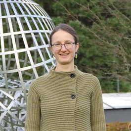

### Speakers

    

        
    

    
    
        

            <a href="http://math.sfsu.edu/federico/">Federico Ardila</a> is a Colombian mathematician and DJ who researches combinatorics and specializes in matroid theory. Ardila graduated from MIT with a B.Sc. in Mathematics in 1998 and obtained a Ph.D in 2003 under the supervision of Richard P. Stanley in the same institution. Ardila is currently a professor at the San Francisco State University and additionally holds an adjunct position at the University of Los Andes in Colombia. In addition to mathematics, Ardila enjoys making music and is a co-founder of the Oakland DJ collective La Pelanga.
        
   
        
  
            <a href="ardila.html">View mini-course details.</a>
        
   
    

    

        
    

    
    
        

            <a href="https://idrissi.eu/">Najib Idrissi</a> is a maître de conférences at Université Paris Cité since 2018. He obtained his PhD in mathematics from the Université de Lille in 2017 under the direction of Benoit Fresse and worked as a postdoc at ETH Zurich in 2018 under Thomas Willwacher. He is mainly interested in operads, whether algebraic or topological, and their applications to the computation of invariants of manifolds and their configuration spaces through the theory of graph complexes. In 2020, he was awarded the Peccot <a href="https://idrissi.eu/research/peccot">Lecture</a> and <a href="https://www.college-de-france.fr/site/cours-peccot/guestlecturer-2020-03-04-11h00.htm">Prize</a> by the Collège de France and lectured on the real homotopy type of configuration spaces.
        
   
        
  
            <a href="idrissi.html">View mini-course details.</a>
        
   
    

    

        
    

    
    
        

            <a href="https://www.maths.tcd.ie/~lebed/">Victoria Lebed</a>  finished her PhD in 2012 at Paris City University (formerly Paris 7). After postdocs at Osaka City University, University of Nantes, and Trinity College Dublin, she settled down at the University of Caen Normandy. Her interests revolve around the vast notions of structure and braiding, in particular their algebraic, homological, topological, and categorical aspects. This includes the Yang–Baxter equation, braid groups, knots and their generalisations, self-distributivity, shuffle algebras, Hopf algebras. She believes that most of mathematics can (and should!) be drawn. She is actively engaged in outreach activities. 
        
   
        
  
            <a href="lebed.html">View mini-course details.</a>
        
   
    

    

        
    

    
    
        

            <a href="https://nicolaslibedinsky.cl/about-me/">Nicolás Libedinsky</a> is a Chilean mathematician. He studied in École Normale Supérieure in Paris and then completed his Ph.D. between Paris Diderot University and Oxford University in 2008. He had an Alexander von Humboldt postdoctoral position in Germany and is now a Professor at the Universidad de Chile. His main interest is (modular) representation theory. In 2019 he published a "mathematical novel" called <em>La unidad de todas las cosas</em>. 
        
   
        
  
            <a href="libedinsky.html">View mini-course details.</a>
        
   
    

    

        
    

    
    
        

            <a href="https://vendramin.github.io/">Leandro Vendramin</a> obtained his Ph.D. in 2010 from Universidad de Buenos Aires. Vendramin's research interests are related to non-commutative algebra. He obtained an Alexander von Humboldt Fellowship and worked as a postdoctoral fellow in the University of Edinburgh.
        
   
        
  
            <a href="vendramin.html">View mini-course details.</a>
        
   
    

